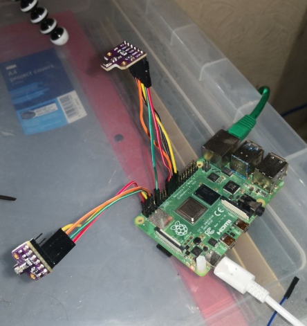

# bme680

Example implementation of BME680 software. The I2C/SPI drivers are meant to run on a Raspberry Pi 4 but you can figure out how to port it.




Connecting the purple BME680 module board to SPI:

| SPI func | BME680 Pin | Raspberry Pi Pin |
| -------- | ---------- | ---------------- |
| MISO     | "SDO"      | GPIO 9 (Pin 21)  |
| MOSI     | "SDA"      | GPIO 10 (Pin 19) |
| SCLK     | "SCL"      | GPIO 11 (Pin 23) |
| CS       | "CS"       | GPIO 8 (Pin 24)  |

In I2C:
| I2C func | BME680 Pin | Raspberry Pi PIN |
| -------- | ---------- | ---------------- |
| 2-6V     | POW        | Vcc 5V (Pin 2)   |
| SDA      | "SDA"      | I2C1 SDA (Pin 3) |
| SCL      | "SCL"      | I2C1 SCL (Pin 5) |
| GND      | GND        | Gnd      (Pin 6) |


## spi demo
```
par_t1: 26203
par_t2: 26519
par_t3: 3
par_p1: 35008
par_p2: -10284
par_p3: 88
par_p4: 9692
par_p5: -202
par_p6: 30
par_p7: 24
par_p8: -4
par_p9: -3469
par_p10: 30
par_h1: 794
par_h2: 1007
par_h3: 0
par_h4: 45
par_h5: 20
par_h6: 120
par_h7: -100
par_g1: 208
par_g2: 59781
par_g3: 18
range_switching_error: 19
res_heat_range: 1
res_heat_val: 46
float mode
tfine: 104906.162500
temp: 20.489485 degC
press: 100089.609193 Pa
humidity: 64.456540 % RH
gas resistance: 12100.310308 Ohm
== for heater target=300.0 and ambient temp=19.0 (degC)
=== gas_valid_r: 1
=== heat_stab_r: 1
```

## i2c demo
```
par_t1: 26125
par_t2: 26370
par_t3: 3
par_p1: 36262
par_p2: -10371
par_p3: 88
par_p4: 6713
par_p5: -103
par_p6: 30
par_p7: 31
par_p8: -251
par_p9: -3158
par_p10: 30
par_h1: 776
par_h2: 1010
par_h3: 0
par_h4: 45
par_h5: 20
par_h6: 120
par_h7: -100
par_g1: 183
par_g2: 59281
par_g3: 18
range_switching_error: 19
res_heat_range: 1
res_heat_val: 39
float mode
tfine: 97289.819111
temp: 19.001918 degC
press: 100226.479673 Pa
humidity: 67.022216 % RH
gas resistance: 14702.868852 Ohm
== for heater target=300.0 and ambient temp=19.0 (degC)
=== gas_valid_r: 1
=== heat_stab_r: 1
```

Note: Two different BME680 devices, one on each type of bus. Perhaps they'd read closer to eachother following a burn-in or something.
